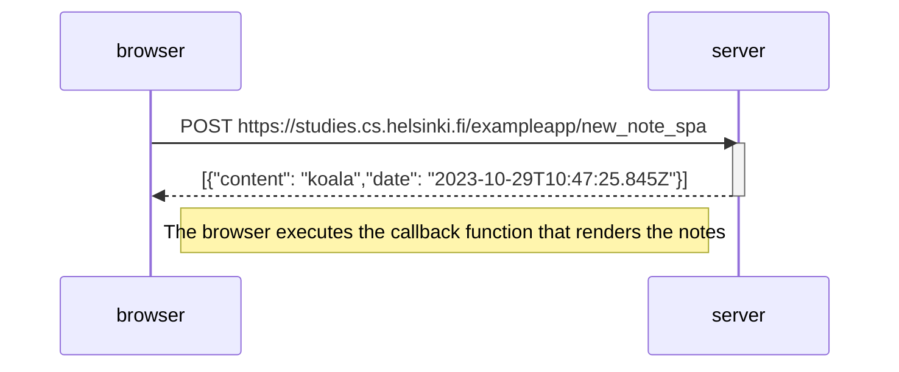

```mermaid

   sequenceDiagram
    participant browser
    participant server


    browser->>server: POST https://studies.cs.helsinki.fi/exampleapp/new_note_spa
    activate server
    server-->>browser: [{"content": "koala","date": "2023-10-29T10:47:25.845Z"}]
    deactivate server

    Note right of browser: The browser executes the callback function that renders the notes
```
